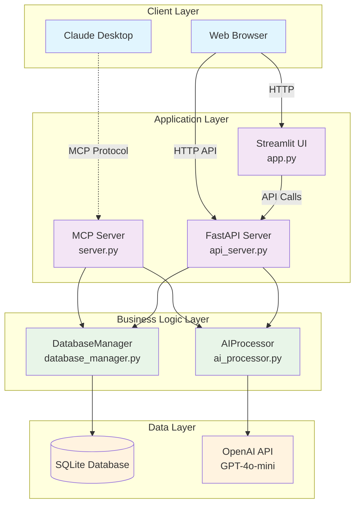
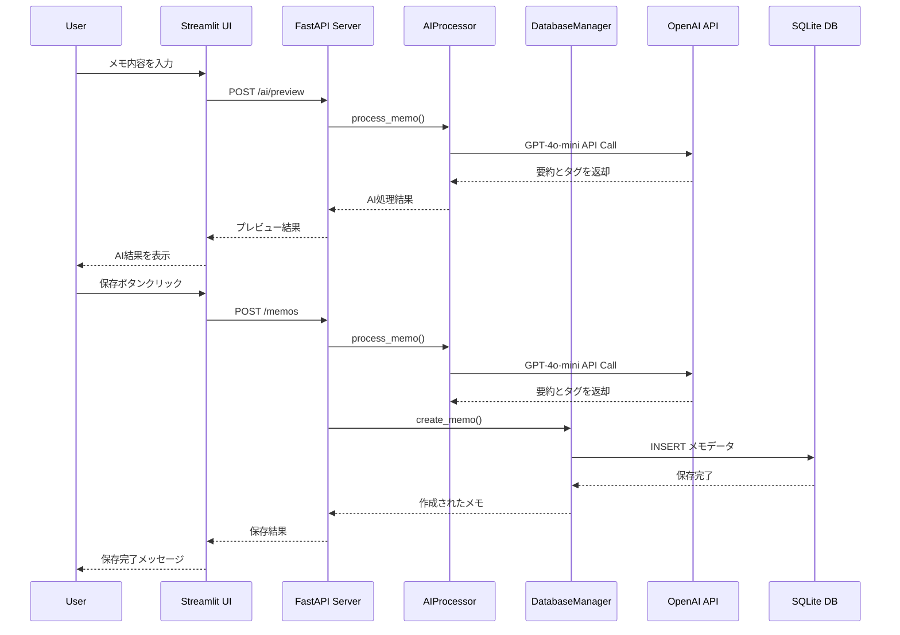
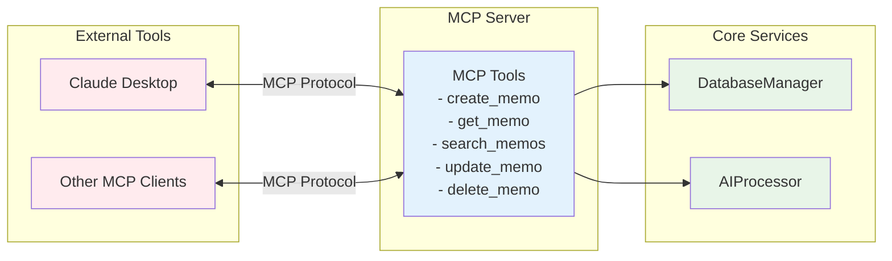

# 🤖 AI Memo App

AIを活用したメモ帳アプリケーションです。メモの作成時に自動的に要約とタグを生成し、効率的なメモ管理を実現します。

## ✨ 機能

- 📝 **メモの作成・編集・削除**
- 🤖 **AI自動要約**: メモの内容を自動的に要約
- 🏷️ **AI自動タグ付け**: 内容に基づいて関連タグを自動生成
- 🔍 **検索機能**: タイトル、内容、タグでの検索
- 📱 **MCP対応**: Model Context Protocolを使用したAI連携
- 🌐 **Web UI**: Streamlitを使用した美しいWebインターフェース

## 🛠️ 技術スタック

- **Backend**: Python, FastMCP, FastAPI
- **Frontend**: Streamlit
- **AI**: OpenAI GPT-4o-mini
- **Database**: SQLite (予定)
- **Package Manager**: UV
- **Environment**: venv

## 🏗️ アーキテクチャ

### システム全体構成



### データフロー



### MCP (Model Context Protocol) 統合



## 🚀 セットアップ

### 1. Docker Desktopのインストール
- [公式サイト](https://www.docker.com/products/docker-desktop/) からDocker Desktopをインストール

### 2. .envファイルの作成
```bash
cp .env.example .env
# .envファイルを編集してOPENAI_API_KEYを設定
```

### 3. アプリケーションの起動
```bash
docker compose up --build -d
```
- 初回は依存パッケージのビルドに数分かかります
- コード修正はホスト側で即時反映されます

### 4. ブラウザでアクセス
- [http://localhost:8501](http://localhost:8501) にアクセス

## 🌐 Web UIの使用方法

### アクセス方法

1. アプリケーションを起動後、ブラウザで `http://localhost:8501` にアクセス
2. 美しいWebインターフェースでメモを管理

### 主な機能

#### 📝 メモの作成
1. サイドバーの「➕ 新しいメモを作成」をクリック
2. タイトルと内容を入力
3. タグをカンマ区切りで入力（オプション）
4. 「💾 保存」をクリック
5. AIによる自動要約とタグ付けが実行されます

#### ✏️ メモの編集
1. サイドバーのメモ一覧から編集したいメモをクリック
2. 内容を編集
3. 「💾 更新」をクリック
4. 「🤖 AI再処理」で要約とタグを再生成

#### 🔍 メモの検索
1. サイドバーの検索ボックスにキーワードを入力
2. タイトル、内容、タグで検索
3. 検索結果がリアルタイムで表示

#### 🗑️ メモの削除
1. メモ編集画面で「🗑️ 削除」をクリック
2. 確認後、メモが削除されます

## 📁 プロジェクト構造

```
my_ai_memo_app/
├── src/
│   ├── backend/          # バックエンド関連
│   │   └── api_server.py # FastAPIサーバー
│   ├── frontend/         # フロントエンド関連
│   │   └── app.py        # Streamlitアプリ
│   ├── models/           # データモデル
│   │   └── memo.py
│   └── utils/            # ユーティリティ
│       └── ai_processor.py
├── .cursor/              # Cursor設定
├── server.py             # MCPサーバー
├── run_app.py            # 起動スクリプト
├── pyproject.toml        # プロジェクト設定と依存関係
├── .env.example         # 環境変数テンプレート
└── README.md
```

## 🔧 使用方法

### MCPツール

以下のMCPツールが利用可能です：

- `create_memo(title, content, tags)`: 新しいメモを作成
- `get_memo(memo_id)`: メモを取得
- `list_memos()`: すべてのメモをリスト表示
- `update_memo(memo_id, title, content, tags)`: メモを更新
- `delete_memo(memo_id)`: メモを削除
- `search_memos(query)`: メモを検索

### 例

```python
# メモの作成
result = create_memo(
    title="会議メモ",
    content="今日の会議では新しいプロジェクトについて話し合いました。来月から開発を開始予定です。",
    tags=["会議", "プロジェクト"]
)

# メモの検索
results = search_memos("プロジェクト")
```

## 🛠️ 開発コマンド

```bash
# 依存関係の管理
uv sync                    # 依存関係のインストール
uv add package-name       # 新しいパッケージを追加
uv add --dev package-name # 開発用パッケージを追加

# アプリケーションの実行
uv run python run_app.py           # 自動起動スクリプト
uv run python src/backend/api_server.py  # APIサーバーのみ
uv run streamlit run src/frontend/app.py # Streamlitアプリのみ

# 開発用依存関係も含めてインストール
uv sync --extra dev

# 仮想環境でスクリプトを実行
uv run python server.py
```

## 🎯 次のステップ

1. **データベース統合**: SQLiteを使用した永続化
2. **認証機能**: ユーザー管理システム
3. **高度な検索**: 全文検索エンジンの統合
4. **エクスポート機能**: PDF、Markdown形式でのエクスポート
5. **リアルタイム同期**: WebSocketを使用したリアルタイム更新

## 🤝 貢献

プルリクエストやイシューの報告を歓迎します！

## �� ライセンス

MIT License 